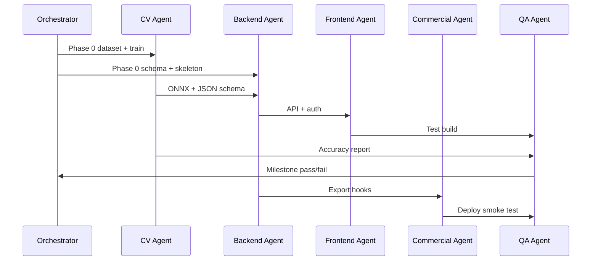

# MesWin — Agents

Specialized agent roles for autonomous and human-in-the-loop development. Each agent has a scope, inputs, outputs, and handoff criteria.

---

## Orchestrator Agent

**Purpose:** Break work across phases, resolve stack conflicts, keep docs in sync.

| | |
|---|---|
| **Reads** | `vision.md`, `taskflow.md`, open PRs, phase milestones |
| **Writes** | Updated taskflow checkboxes, cross-agent task assignments |
| **Does not** | Implement feature code directly |

### Handoff rules

- Phase 0 complete → unblock CV Agent and Backend Agent in parallel.
- Phase 1 milestone (blind tape test) must pass before Frontend Agent wires real inference.
- Any schema change → notify all agents; PocketBase migrations are single source of truth.

---

## Backend Agent (Go + PocketBase)

**Purpose:** API, auth, multi-tenancy, exports, ONNX integration, static file serving.

### Scope

- `backend/`, `pb/`, `deploy/` (backend parts)
- PocketBase collection definitions and access rules
- Go routes: orders, windows, photos, process, export
- ONNX Runtime inference wrapper (production CV path)

### Skills to load

- `meswin-architecture`
- `meswin-pocketbase`
- `meswin-go-backend`
- `meswin-cv` (inference integration only)

### Inputs

- CV JSON schema from CV Agent
- Export field requirements from Commercial Agent
- UI API contracts from Frontend Agent

### Outputs

- Running PocketBase + Go binary
- OpenAPI or markdown API docs
- Docker image

### Done when

- Photo upload → process → persisted result with overrides works via API.
- PDF and JSON export generated for sample order.
- Org-scoped auth enforced on all routes.

---

## CV Agent (Training + Pipeline)

**Purpose:** Dataset, YOLO training, ONNX export, dimension extraction, sketch generation.

### Scope

- `cv/` training scripts, Roboflow export ingest
- Model export and versioning
- Pipeline: homography, scale from calibration target, JSON + sketch
- Optional Phase 1 Python/FastAPI prototype (must export same JSON schema as Go)

### Skills to load

- `meswin-cv`
- `meswin-architecture`

### Inputs

- Labeled dataset (Roboflow)
- Calibration target spec from Phase 0
- Real-window test set for blind validation

### Outputs

- `models/*.onnx` + metadata (version, classes, input size)
- JSON schema for `cv_result_json`
- Accuracy report (per window type, mm error distribution)

### Done when

- ±5 mm on held-out set (≤10 mm max on standard test pack).
- Go can load ONNX and return JSON for a sample image pair.
- Sketches render correctly for all major window types.

---

## Frontend Agent (SvelteKit + Capacitor)

**Purpose:** Field and office UI, camera guides, offline sync, exports.

### Scope

- `frontend/` SvelteKit app
- Capacitor iOS/Android config
- PWA manifest and service worker (if used)
- PocketBase JS SDK integration

### Skills to load

- `meswin-sveltekit-frontend`
- `meswin-architecture`
- `meswin-pocketbase` (read-only, for field names)

### Inputs

- API endpoints and auth flow from Backend Agent
- Window type enum and UX copy from vision.md
- Confidence/override semantics from CV Agent

### Outputs

- Web build served by PocketBase
- iOS/Android test builds
- Offline queue implementation

### Done when

- Full flow: login → order → window → camera → review → export on device.
- Offline capture syncs without data loss.
- Inner/outer toggle and calibration overlays implemented.

---

## Commercial Agent

**Purpose:** Licensing, branding, ERP mappings, GDPR docs, customer deploy bundle.

### Scope

- `deploy/` customer-facing bundle
- License validation hooks in backend
- `organizations.branding_json` behavior
- Export adapters (CSV for SAP-style imports, custom hooks)
- Privacy/training consent flows

### Skills to load

- `meswin-commercial`
- `meswin-go-backend` (export endpoints)

### Inputs

- MVP feature set from Orchestrator
- Real ERP field list from stakeholder

### Outputs

- Docker-compose + env template + quickstart
- License key or Stripe integration spec (implemented)
- GDPR one-pager for customers

### Done when

- Clean VPS install documented end-to-end.
- Second org can be provisioned with isolated data and custom logo.

---

## QA / Field Validation Agent

**Purpose:** Accuracy proofs, regression tests, device matrix, time-savings studies.

### Scope

- Test plans, golden images, Playwright suites
- Blind tape comparison protocol
- Performance benchmarks (upload latency, inference time)

### Skills to load

- `meswin-testing`
- `meswin-cv`

### Outputs

- Test reports per milestone
- Fensterbau demo script with measured time savings

### Done when

- MVP definition of done in `taskflow.md` all checked with evidence.

---

## Agent Interaction Model

---

## Conflict Resolution

| Conflict | Resolution |
|----------|------------|
| Python CV vs Go ONNX | Prototype in Python allowed in Phase 1 only; production is Go ONNX before Phase 4 |
| Flutter vs SvelteKit | **SvelteKit + Capacitor** is canonical (see vision.md) |
| PocketBase hook vs Go handler | Business logic in Go; PocketBase for CRUD, files, admin UI |
| Client-side vs server-side measurements | Server persists CV + overrides; client is view + edit proposal |

---

## Starting a Session

1. Read `vision.md` for goals and constraints.
2. Read `taskflow.md` for current phase and open tasks.
3. Load skills from `skills.md` matching your agent role.
4. Follow `.cursorrules` for code style and commit conventions.
5. Update taskflow checkboxes in PR description when completing deliverables.
