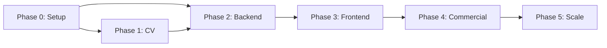

# MesWin — Taskflow

Go + PocketBase backend, SvelteKit + Capacitor frontend, ONNX-based CV. Phases are ordered; parallel work is noted where safe.

---

## Phase 0: Research & Setup

**Goal:** Schema, dataset, calibration hardware, project skeleton.

### Tasks

- [x] Define data models: Organizations, Users, Customers, Measuring Orders, Window Items, Files (multi-tenant from the start).
- [ ] Design and print professional calibration target (100×100 mm+ triangle, 10 mm red lines, durable/weatherproof).
- [ ] Capture and label dataset (500–1000+ photos per major type) in Roboflow.
- [ ] Cover window types in dataset:
  - **Single:** Fixed, Tilt & Turn, Side-Hung Casement, Tilt-Only
  - **Double:** Fixed + Operable, Two Tilt & Turn, French-Style Double Casement
  - **Triple:** Fixed + Center Operable + Fixed, Operable + Fixed + Operable, Triple Fixed/Operable
  - **Multi:** 4+ units, transom combinations, with/without mullions
- [x] Set up PocketBase + Go project skeleton.
- [x] Prototype CV path: stub ONNX inference hook from Go.

### Deliverables

- Labeled dataset (priority: Tilt & Turn variants).
- PocketBase schema with multi-tenant fields.
- Baseline YOLO model (training can continue into Phase 1).
- Repo with Go module, PocketBase hooks, and CI lint/test stubs.

### Parallel tracks

| Track | Owner focus |
|-------|-------------|
| A | PocketBase schema + Go skeleton |
| B | Calibration target print + photo collection |
| C | Dataset labeling + initial YOLO train |

---

## Phase 1: Core CV Pipeline

**Goal:** Reliable dimension extraction from multi-photo inner/outer captures.

### Tasks

- [ ] Train/fine-tune YOLOv8/v11 for: calibration target, window frames, sashes, corners, mullions, openable/fixed indicators.
- [ ] Export model to ONNX; integrate **ONNX Runtime in Go** (`backend/internal/cv/`).
- [ ] Build processing pipeline in Go: multi-photo → homography correction → dimension extraction → annotated sketch (SVG/PNG) → JSON with confidence scores.
- [ ] Accuracy target: ±5 mm on held-out test set.

### Deliverables

- Deployable Go CV package with ONNX inference.
- Integration tested with sample images from real windows.
- JSON schema for measurements + sketch assets.

### Milestone

**Blind test vs manual tape on real Synego windows** — document errors and failure modes.

---

## Phase 2: Backend (Go + PocketBase)

**Goal:** Production backend ready for self-hosting.

### Tasks

- [ ] PocketBase collections: `organizations`, `users`, `customers`, `measuring_orders`, `window_items`, `files`.
- [ ] Custom Go handlers/routes:
  - Shopping-cart style measuring order creation.
  - Photo upload → CV processing → store results + user overrides.
  - Inner/outer multi-photo support per window item.
  - Export: Markdown, PDF (with sketches), JSON/CSV for ERP.
- [ ] Auth, role-based access (field, reviewer, admin), basic multi-tenancy.
- [ ] Admin UI via PocketBase; custom Go API for office review workflows.
- [ ] Serve SvelteKit static build from PocketBase (single-binary deploy story).

### Deliverables

- Docker/VPS-ready backend image.
- API documentation (OpenAPI or markdown).
- Export samples for at least one ERP/CSV format.

---

## Phase 3: Frontend (SvelteKit + Capacitor)

**Goal:** Cross-platform app (web + native) fully integrated with backend.

### Tasks

- [ ] Initialize SvelteKit project + Tailwind (Flowbite-Svelte for forms).
- [ ] Integrate PocketBase JS SDK (auth, orders, windows, files).
- [ ] Core flows:
  1. Login / select or create organization.
  2. New measuring order + customer data.
  3. Add windows (type selector from EU list).
  4. Guided camera: inner/outer toggle, calibration target overlays (`@capacitor/camera`).
  5. Upload → trigger Go/ONNX processing → results + manual overrides + confidence.
  6. Review page: annotated sketches + dimensions.
  7. Export: PDF / Markdown / JSON.
- [ ] Offline support: local queue for photos and drafts, sync on reconnect.
- [ ] Capacitor: iOS/Android platforms, native plugins, device testing.
- [ ] PWA: installable, offline shell.

### Deliverables

- End-to-end MVP: capture → process → review → export.
- Test builds for iOS, Android, and web.

### Milestone

**Field test with real Synego windows** — measure time saved vs tape; target 50%+ reduction.

---

## Phase 4: Commercial Polish & Deployment

**Goal:** Market-ready product (self-hosted + optional SaaS).

### Tasks

- [ ] Multi-tenancy hardening (strict org isolation, admin tooling).
- [ ] Branding / white-label (logo, colors, app name).
- [ ] ERP integration hooks (internal system + SAP-style CSV + custom mappings).
- [ ] Licensing & billing (Stripe or license keys).
- [ ] Documentation, installer scripts, Docker-compose customer bundle.
- [ ] Security review (GDPR, file retention, consent for training data).
- [ ] Performance testing (concurrent uploads, large orders).
- [ ] Marketing assets: demo videos, accuracy proof, time-saving case studies for Fensterbau Frontale.

### Deliverables

- Customer-ready self-host package.
- License activation flow.
- Sales/demo environment.

---

## Phase 5: Iteration & Scaling

**Goal:** Reduce dependencies, grow features and customer base.

### Tasks

- [ ] On-device ONNX inference (optional: mobile runtime later via Capacitor plugin).
- [ ] Advanced features: AR preview, bulk orders, analytics dashboard.
- [ ] Model retraining pipeline from user-corrected data (with consent).
- [ ] PostgreSQL migration path for multi-tenant scale.
- [ ] Fensterbau Frontale — demo booth prep and live measurements.

### Deliverables

- Retraining playbook.
- Scale-tested deployment guide.
- Trade-show demo kit.

---

## Immediate Next Steps (Team)

1. **Today:** Set up PocketBase + Go skeleton; commit schema draft.
2. **This week:** Build calibration target; start dataset collection (Tilt & Turn first).
3. **In parallel:** Export first ONNX model and wire hello-world inference in Go.

---

## Dependency Graph

---

## Definition of Done (MVP)

- [ ] Measurer completes an order with 3+ window types on a real site, offline then sync.
- [ ] Dimensions within ±5 mm on blind tape comparison for majority of items.
- [ ] PDF export accepted by office/production workflow.
- [ ] Single-command Docker deploy documented and tested on clean VPS.
